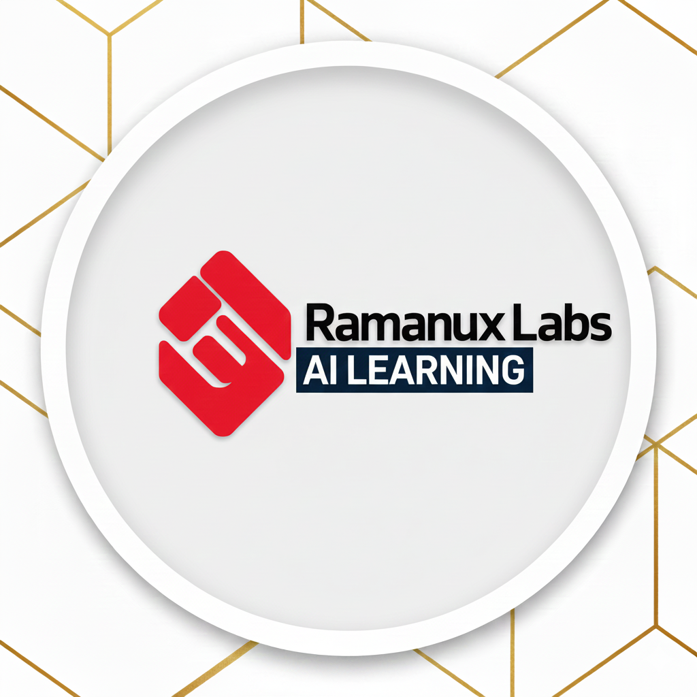

  

Welcome to **Ramanux Lab** — your one-stop destination to master **Math, Machine Learning, NLP, LLMs, and GenAI** with absolute clarity.
## 📺 YouTube Channel

Follow the full video series here:  
👉 **[Ramanux Lab — YouTube Channel](https://youtube.com/@ramanuxailabs?si=QoJAqXzST8IhTNCs)**  
Subscribe for deep dives into ML, NLP, GenAI, and Legal AI systems!

Here, we break down complex topics into simple, intuitive lessons backed by real-world implementations. Whether you're a beginner building foundations or a professional sharpening your expertise, this channel gives you a complete roadmap from:
## 📘 Course Roadmap

- **Math for Machine Learning**
  - Statistics & Distributions
  - Probability & Random Variables    
  - Linear Algebra for ML  
  - Calculus & Optimization  

- **Machine Learning Fundamentals & Projects**
  - Supervised & Unsupervised Learning  
  - Model Evaluation, Bias–Variance, Regularization  
  - End-to-end ML Projects  

- **Deep Learning & Neural Networks**
  - Perceptrons, Backpropagation  
  - CNNs, RNNs, LSTMs  
  - Training Tricks & Optimization  

- **Natural Language Processing**
  - Text Processing & Word Embeddings  
  - Seq2Seq Models, Attention  
  - Transformers Architecture  

- **LLMs, RAG, Agents, LangChain & GenAI Systems**
  - LLM Theory & Tokenization  
  - RAG Pipelines & Vector Databases  
  - LangChain, LangGraph, Agents  
  - Fine-tuning with LoRA / PEFT  

Every video is designed to help you **understand, apply, and build**.

At Ramanux Lab, we believe learning should be practical, structured, and enjoyable.
Join the community — and let’s build intelligence, one concept at a time.
